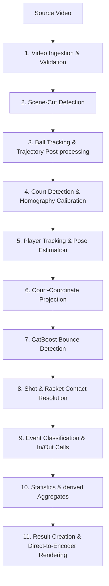
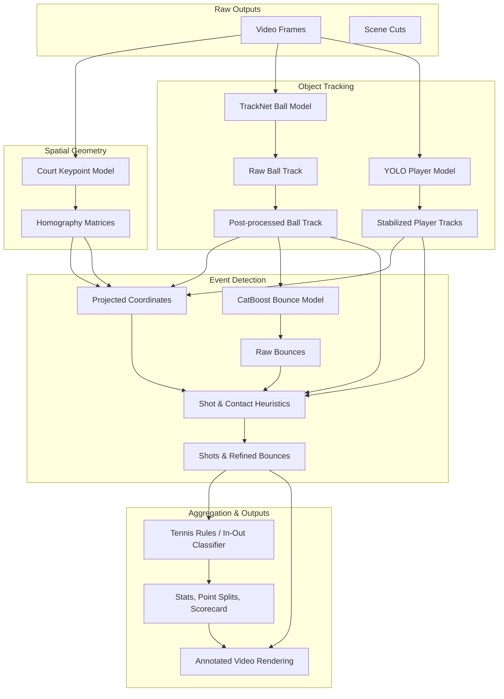

# Tennis Analysis Pipeline Reference

This document provides a technical walkthrough of the complete computer-vision and event-classification pipeline of the Tennis Analyzer. It maps the stages in execution order, explaining how video frames are ingested, processed through deep learning models and heuristic passes, projected to court-space, and finally resolved into structured match statistics and annotated video.

## Pipeline Architecture Overview

The pipeline processes tennis matches through a series of sequential, low-memory stages. Rather than loading the entire video into memory, the system uses bounded frame-chunking, running each model once per required analysis stage.



### Stage Dependencies

Later stages depend on the coordinates and matrices generated by earlier stages. Below is the dependency graph showing how stage outputs flow.



---

## Detailed Pipeline Stages

### 1. Video Validation and Frame Decoding

* **Code Reference**: [video.py](file:///C:/Users/mbonatte/Documents/Coding/tennis/tennis_analyzer/video.py), [chunks.py](file:///C:/Users/mbonatte/Documents/Coding/tennis/tennis_analyzer/pipeline/chunks.py), [service.py](file:///C:/Users/mbonatte/Documents/Coding/tennis/tennis_analyzer/pipeline/service.py)

#### How it works
1. **FFprobe Validation**: The pipeline invokes `FFprobe` via the [probe_video](file:///C:/Users/mbonatte/Documents/Coding/tennis/tennis_analyzer/video.py#L23) function to inspect the container and streams. It enforces:
   - File presence and size > 0.
   - A valid video stream with positive width/height.
   - Codec safelisting (e.g., `h264`, `hevc`, `vp8`, `vp9`, `av1`).
   - Frame rate parsing (calculating real FPS from `avg_frame_rate`).
   - Resolution and duration limits check (against configuration settings).
2. **Incremental Decoding**: Frames are decoded on-demand inside [iter_frame_chunks](file:///C:/Users/mbonatte/Documents/Coding/tennis/tennis_analyzer/pipeline/chunks.py#L32) using standard OpenCV `VideoCapture` read loops.
3. **Chunking Mechanism**: To run in memory-constrained environments, frames are read and processed in contiguous, non-overlapping chunks (configured by `ANALYSIS_CHUNK_FRAMES`, default 128).
4. **State Preservation**: Frame indices map directly to zero-based global frame numbers. To ensure temporal continuity across chunk boundaries, temporal models use custom adapters:
   - **Ball Tracking**: The [BallTracker](file:///C:/Users/mbonatte/Documents/Coding/tennis/ball.py#L183) uses a [TemporalContextBuffer](file:///C:/Users/mbonatte/Documents/Coding/tennis/tennis_analyzer/pipeline/temporal.py) to save the last 2 frames of the previous chunk and prepend them to the current chunk, trimming the corresponding duplicate outputs.
   - **Player Tracking**: The Kalman filters and tracker states in ByteTrack are updated frame-by-frame and persist in the tracker instance across chunk executions.
   - **Scene-Cut Detection**: The HSV color histogram of the final frame in each chunk is preserved to evaluate transition into the first frame of the subsequent chunk.

---

### 2. Scene-Cut Detection

* **Code Reference**: [service.py](file:///C:/Users/mbonatte/Documents/Coding/tennis/tennis_analyzer/pipeline/service.py#L373) (`_histogram`), [analysis.py](file:///C:/Users/mbonatte/Documents/Coding/tennis/analysis.py#L62) (`detect_scene_cuts`)

#### How it works
1. **Signal**: Comparison of consecutive frame color histograms. Each frame is converted from BGR to the HSV color space, and a 2D histogram of the Hue and Saturation channels is computed.
2. **Comparison Metric**: The system measures the Bhattacharyya distance between adjacent frame histograms using OpenCV's `compareHist` with the `HISTCMP_BHATTACHARYYA` method.
3. **Threshold**: A scene change is identified when the Bhattacharyya distance is `>= 0.55`.
4. **Downstream Effects**:
   - Scene change frames are added as mandatory indices to the representative frames during Court Detection calibration.
   - Aggregation statistics ignore frames before the last detected scene cut to exclude pre-match warm-ups, broadcasters' graphics, or intro reels.
5. **Limitations**:
   - *False Positives*: Strobes, flash photography, quick shadows, or player silhouettes completely covering the lens.
   - *False Negatives*: Very slow dissolves, fades, or panning transitions.

---

### 3. Ball Tracking

* **Code Reference**: [ball.py](file:///C:/Users/mbonatte/Documents/Coding/tennis/ball.py), [ball_track.py](file:///C:/Users/mbonatte/Documents/Coding/tennis/tennis_analyzer/pipeline/ball_track.py)

#### How it works
1. **Model Architecture**: A TrackNet-style Fully Convolutional Network with 9 input channels (representing a temporal window of 3 consecutive BGR frames: current, previous, and pre-previous) and 256 output channels.
2. **Inference Resolution**: Raw frames are resized to `640x360` pixels and normalized by dividing color channel values by `255.0`.
3. **Heatmap Interpretation**:
   - The 256 output channels represent predicted intensity values `[0, 255]` for each pixel.
   - The argmax along the channel dimension is taken, producing a 2D intensity grid.
   - **Heatmap Inversion Ring**: The code multiplies the argmax index map by `255` and casts to `np.uint8`. Because the class labels are `[0, 255]` representing intensity, multiplying by `255` in uint8 math maps a center value of `255` to `255 * 255 = 65025 % 256 = 1`, and a margin value of `1` to `1 * 255 % 256 = 255`. This creates a high-contrast binary outer "ring" around the predicted ball location rather than a solid spot.
   - Thresholding is applied at `127`, and `cv2.HoughCircles` detects circles on this donut-like contour.
   - If exactly one circle is found, its center coordinates are scaled back to the original video dimensions. If zero or multiple circles are detected, the coordinates are marked `(None, None)`.
4. **Trajectory Post-Processing Sequence**:
   - *Normalization*: Out-of-bounds or non-finite values are cast to `(None, None)`.
   - *Abrupt-Jump Removal*: Single-frame coordinates that spike far from their adjacent frames (while those adjacent frames are close to each other) are discarded. The threshold scales dynamically with local median ball speed to preserve real fast rally frames.
   - *Outlier Removal*: Out-of-bounds coordinates based on distance thresholds are replaced with `(None, None)`.
   - *Splitting & Interpolation*: Trajectories are segmented into continuous pieces. Missing frames within a maximum gap of 4 frames and maximum distance of 80 pixels are linearly interpolated.
   - *Extrapolation*: Fills in coordinate tracks where the ball was temporarily lost.

---

### 4. Court Detection and Homography

* **Code Reference**: [court.py](file:///C:/Users/mbonatte/Documents/Coding/tennis/court.py), [court_detection_net.py](file:///C:/Users/mbonatte/Documents/Coding/tennis/court_detection_net.py), [homography.py](file:///C:/Users/mbonatte/Documents/Coding/tennis/homography.py), [postprocess.py](file:///C:/Users/mbonatte/Documents/Coding/tennis/postprocess.py)

#### How it works
1. **Learned Keypoint Prediction**: A CNN predicting heatmaps for 14 landmark court intersections (corners and service line intersections) from a single frame resized to `640x360`.
2. **Local Keypoint Refinement**:
   - Around each predicted keypoint (excluding indices `8`, `9`, and `12` due to net/distance distortion), a local `80x80` pixel crop is extracted.
   - Grayscale conversion, binary thresholding (155), and Probabilistic Hough Line Transform (`HoughLinesP`) detect white line segments.
   - Overlapping/parallel lines are merged.
   - If exactly 2 line segments remain, the math intersection is calculated using sympy. If this intersection falls within the crop, it replaces the raw model coordinate.
3. **Homography Optimization**:
   - The system maps reference court coordinate values (from [CourtReference](file:///C:/Users/mbonatte/Documents/Coding/tennis/court_reference.py)) to detected keypoints.
   - It iterates through 12 configurations of 4-point groups, computes the homography matrix using Direct Linear Transform (no RANSAC, DLT method), projects all reference keypoints, and measures mean displacement error.
   - The matrix yielding the lowest average error across all remaining keypoints is selected.
4. **Static Calibration & Propagation**:
   - *Heuristic Check*: Evaluates court stability across 9 evenly distributed frames and scene cuts. If court displacement variance is `<= 2%` of the image diagonal, it assumes a fixed camera and reuses the median homography across all frames.
   - *Moving Camera Fallback*: If variance exceeds 2%, it calculates a unique homography for every frame.
   - *User Calibration*: A user-supplied static 4-corner coordinate selection overrides automatic model output, completely bypassing model inference and applying a fixed homography.

---

### 5. Player Detection and Tracking

* **Code Reference**: [player.py](file:///C:/Users/mbonatte/Documents/Coding/tennis/player.py), [tracking_postprocess.py](file:///C:/Users/mbonatte/Documents/Coding/tennis/tracking_postprocess.py)

#### How it works
1. **Model Ingestion**: YOLO (`yolo26n.pt` for bounding boxes, `yolo26n-pose.pt` for skeleton keypoints) filtering for person detections (class 0) with a confidence `>= 0.5`. Bounding boxes smaller than 500 pixels are ignored.
2. **Temporal Tracking**: Detections are linked across frames using ByteTrack.
3. **Role Assignment (`top_player` vs `bottom_player`)**:
   - In behind-the-court camera layouts, the far-court player is located in the top screen half, and the near-court player in the bottom screen half.
   - Detections are assigned to roles based on the screen midpoint (`mid_y`).
   - ByteTrack identity overrides the midpoint heuristic: once a player is assigned a role, they retain it even if they cross the midpoint during a rally.
   - Distance limits prevent role-swapping during extreme movements.
4. **Missing Player Recovery (Zoomed ROI)**:
   - If a previously tracked player is lost, a zoomed Region of Interest (ROI) is cropped around their last known position.
   - The ROI is scaled up (`2x` bilinear interpolation), and a secondary YOLO model predicts player presence at a lower confidence threshold (`0.15`).
   - If recovered, the bounding box coordinates are mapped back to screen space.
5. **Pose Adaptation**:
   - When pose tracking is enabled, YOLO-Pose predictions are matched to ByteTrack boxes using an Intersection over Union (IoU) and center distance scoring model.
   - Keypoints must have confidence `>= 0.35`.

---

### 6. Court-Coordinate Projection

* **Code Reference**: [analysis.py](file:///C:/Users/mbonatte/Documents/Coding/tennis/analysis.py#L80) (`project_ball_track`), [analysis.py](file:///C:/Users/mbonatte/Documents/Coding/tennis/analysis.py#L92) (`project_player_tracks`)

#### How it works
1. **Homography Transformation**: Screen coordinates are transformed into physical court coordinates via `cv2.perspectiveTransform` using the homography matrix $H$:
   $$\begin{bmatrix} x_{court} \\ y_{court} \\ w \end{bmatrix} = H \begin{bmatrix} x_{screen} \\ y_{screen} \\ 1 \end{bmatrix}$$
2. **Player Foot Reference**: The screen coordinate of a player is defined as the bottom-middle of their bounding box:
   $$x_{foot} = \frac{x_1 + x_2}{2}, \quad y_{foot} = y_2$$
   This bottom-center coordinate is then projected onto the court plane.
3. **Missing Homography Handling**: If homography calculation fails for a frame (due to camera occlusion or extreme panning), projected court-space positions are returned as `None`.
4. **Canonical Court System**:
   - The reference court coordinate system is modeled in pixels on a 1665x4032 reference canvas.
   - The physical court boundaries represent $10.97 \times 23.77$ meters.
   - Conversion scales: $\approx 101.8$ pixels/meter on the X-axis, $\approx 101.3$ pixels/meter on the Y-axis.

#### Reference Coordinate Diagram (Top-Down View)

```text
(0,0) ------------------------------------------------------------- (1665, 0)
|     |  Margin Top: 549                                         |      |
|     |                                                          |      |
|    (286, 561) Top-Left Doubles Corner ------------------------ (1379, 561)
|     |   |                                                  |   |      |
|     |   | (423, 561) Top-Left Singles Corner               |   |      |
|     |   |   |                                              |   |      |
|     |   |   |                                              |   |      |
|     |   |   |-- (423, 1110) Top Service Line               |   |      |
|     |   |   |   |                     |                    |   |      |
|     |   |   |   | (832, 1110)         | (1242, 1110)       |   |      |
|     |   |   |   | Center Service T    |                    |   |      |
|     |   |   |   |                     |                    |   |      |
|    (286, 1748) Net Line -------------------------------------- (1379, 1748)
|     |   |   |   |                     |                    |   |      |
|     |   |   |   |                     |                    |   |      |
|     |   |   |   | (832, 2386)         | (1242, 2386)       |   |      |
|     |   |   |   |                     |                    |   |      |
|     |   |   |-- Bottom Service Line -----------------------|   |      |
|     |   |   |                                              |   |      |
|     |   |   | (423, 2935) Bottom-Left Singles Corner       |   |      |
|    (286, 2935) Bottom-Left Doubles Corner -------------------- (1379, 2935)
|     |                                                          |      |
|     |  Margin Bottom: 549                                      |      |
(0, 4032) --------------------------------------------------------- (1665, 4032)
```

---

### 7. Bounce Detection

* **Code Reference**: [bounce_detector.py](file:///C:/Users/mbonatte/Documents/Coding/tennis/bounce_detector.py)

#### How it works
1. **Model Architecture**: A CatBoost Regressor evaluating trajectory shape changes rather than video frame contents.
2. **Feature Window**: Operates on a rolling 5-frame window of ball tracking coordinates: $t-2, t-1, t, t+1, t+2$.
3. **Feature Engineering**:
   - 12 features are generated from coordinate differences:
     - $X$-axis displacements: absolute differences $|x_{t-i} - x_t|$, $|x_{t+i} - x_t|$, and their ratios.
     - $Y$-axis displacements: signed differences $(y_{t-i} - y_t)$, $(y_{t+i} - y_t)$, and their ratios.
   - Missing coordinates are smoothed using local `CubicSpline` extrapolation from 5 preceding frames prior to feature calculation.
4. **Thresholding & Suppression**:
   - The CatBoost output represents a bounce probability. A bounce candidate is identified when score $> 0.45$.
   - Contiguous predictions are suppressed: if multiple consecutive frames exceed the threshold, the local peak (maximum CatBoost score) is selected as the bounce frame.

---

### 8. Shot and Contact Detection

* **Code Reference**: [analysis.py](file:///C:/Users/mbonatte/Documents/Coding/tennis/analysis.py#L1268) (`detect_shot_events`), [analysis.py](file:///C:/Users/mbonatte/Documents/Coding/tennis/analysis.py#L807) (`resolve_contact_like_bounces`), [analysis.py](file:///C:/Users/mbonatte/Documents/Coding/tennis/analysis.py#L917) (`align_shots_to_player_box_contacts`), [analysis.py](file:///C:/Users/mbonatte/Documents/Coding/tennis/analysis.py#L219) (`enforce_rally_player_alternation`)

#### How it works
1. **Initial Trajectory Reversals**: Initial shot candidates are identified by finding sustained vertical trajectory direction changes. A rolling average of y-coordinates is checked. A direction reversal is registered when the vertical velocity changes sign, and the ball maintains the new direction for at least 12 subsequent frames (preventing micro-jitter false positives).
2. **Bounce-to-Shot Reclassification (Proximity Heuristics)**:
   - A predicted trajectory bounce landing within a player's bounding box is reclassified as a racket contact (shot event), and removed from the bounce list.
3. **Serve Contact Recovery**:
   - If a rally starts but the initial serve hit is missing, the pipeline searches backwards from the first bounce to find the vertical acceleration peak where the ball was thrown or hit.
4. **Alternating Rally Enforcement**:
   - Tennis rallies alternate hits between opposing sides.
   - If two consecutive shots are assigned to the same player role, the duplicate with the lower speed or larger distance to the ball is dropped.
   - Missing alternating shots are recovered by analyzing trajectory inflections in proximity to the player.

---

### 9. Bounce Classification and In/Out Calls

* **Code Reference**: [analysis.py](file:///C:/Users/mbonatte/Documents/Coding/tennis/analysis.py#L1198) (`classify_bounces`), [analysis.py](file:///C:/Users/mbonatte/Documents/Coding/tennis/analysis.py#L1413) (`_classify_serve_bounce`), [analysis.py](file:///C:/Users/mbonatte/Documents/Coding/tennis/analysis.py#L1438) (`_classify_game_bounce`)

#### How it works
1. **Phase Resolution**:
   - The phase of the bounce depends on the index of the preceding shot event.
   - If no preceding shot is registered, the bounce is classified as `pre_shot` with `unknown` status.
   - If the first shot of the rally is the preceding event, the bounce is classified as `serve`.
   - Subsequent bounces are classified as `game` (rally).
2. **Serve Bounce Rules**:
   - Must land in the service box diagonally opposite the serving player.
   - E.g., if the server is `top_player`, the serve must land in the bottom service boxes: between the net ($y=1748$) and bottom service line ($y=2386$), and inside the singles sidelines ($x \in [423, 1242]$). The left/right service box division is checked using the center service line ($x=832$).
3. **Rally Bounce Rules**:
   - Must land within the singles court boundary rectangle: between the top baseline ($y=561$), bottom baseline ($y=2935$), and singles sidelines ($x \in [423, 1242]$).
4. **In/Out Decisions**:
   - If the projected coordinate $(x_{court}, y_{court})$ falls within the respective boundary rectangle (inclusive of lines), the bounce is marked `in`.
   - If it falls outside the active region, it is marked `out`.

---

### 10. Statistics and Derived Events

* **Code Reference**: [analysis.py](file:///C:/Users/mbonatte/Documents/Coding/tennis/analysis.py#L1524) (`_segment_speeds`), [analysis.py](file:///C:/Users/mbonatte/Documents/Coding/tennis/analysis.py#L201) (`_compute_player_stats`), [scoring.py](file:///C:/Users/mbonatte/Documents/Coding/tennis/tennis_analyzer/scoring.py)

#### How it works
1. **Ball Speeds**:
   - Segment velocity is computed by dividing physical distance (transformed to meters using court scales) by frame time interval:
     $$\text{speed (km/h)} = \sqrt{\Delta x^2 + \Delta y^2} \times \text{FPS} \times 3.6$$
   - Extreme speeds exceeding $280\text{ km/h}$ are discarded as tracking errors.
2. **Player Movement Distance**:
   - Computed by accumulating frame-to-frame Euclidean distance of the projected player foot points across all frames in a rally.
3. **Scorecard and Point Splitting**:
   - Point boundaries are identified by grouping rallies separated by prolonged quiet periods (gaps of $> 5$ seconds between bounce events).
   - Points are fed into [score_match](file:///C:/Users/mbonatte/Documents/Coding/tennis/tennis_analyzer/scoring.py#L35) which tracks set and game scoring using standard tennis rules (15, 30, 40, game, tiebreak).

---

### 11. Result Creation and Rendering

* **Code Reference**: [service.py](file:///C:/Users/mbonatte/Documents/Coding/tennis/tennis_analyzer/pipeline/service.py#L178) (`render_from_artifact`), [service.py](file:///C:/Users/mbonatte/Documents/Coding/tennis/tennis_analyzer/pipeline/service.py#L439) (`analyze_video`)

#### How it works
1. **Saved Artifact vs Result**:
   - Analysis results are saved to `analysis-artifact.json`. This contains raw arrays (e.g., player bounding boxes, keypoints, homographies, ball coordinates) enabling future render variants without running model inference again.
   - User-facing summaries are stored in `result.json`.
2. **Overlay Rendering**:
   - When a render variant is requested, `render_from_artifact` reads the saved coordinates.
   - Drawing functions overlay elements directly onto the decoded frames: ball trails, scoreboard, player boxes, keypoint markers, and minimaps.
3. **Video Encoder Normalization**:
   - Raw output from OpenCV is written to `.rendered.mp4` using the `mp4v` codec.
   - The pipeline invokes FFmpeg to mux the original audio stream back, convert video to `libx264` format with H.264 profile, configure `yuv420p` pixel format, and apply `+faststart` flags for web browser playback compatibility.
