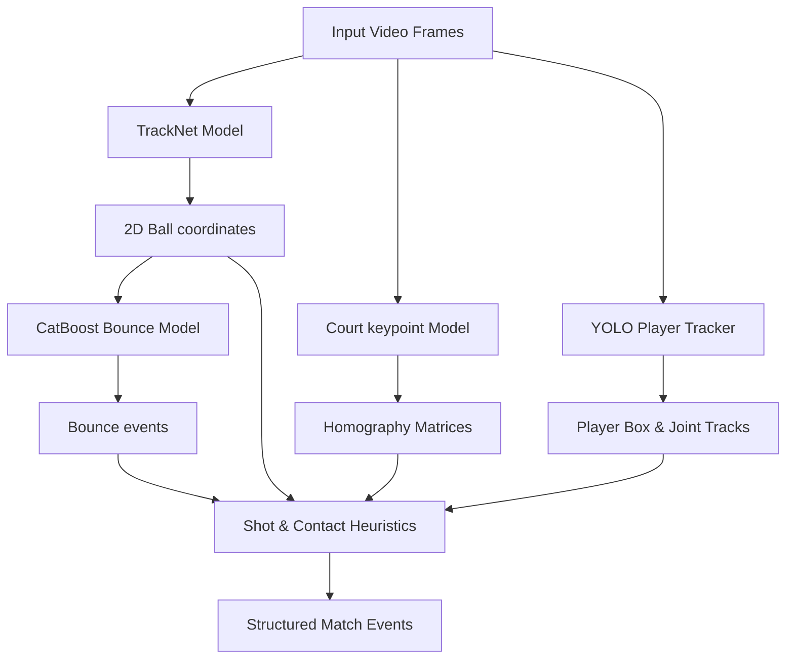

# Tennis Analysis Models Overview

This directory contains model cards for the four machine learning and deep learning models deployed in the Tennis Analyzer pipeline.

## Model Inventory

| Feature | Model Card | Checkpoint Filename | Framework | Purpose |
|---|---|---|---|---|
| **Ball Tracking** | [BALL_TRACKING.md](BALL_TRACKING.md) | `tracknet_model.pt` | PyTorch | Detects 2D coordinate positions of the ball across consecutive frames. |
| **Court Detection** | [COURT_DETECTION.md](COURT_DETECTION.md) | `tennis_court.pt` | PyTorch | Detects 14 landmark court intersections to compute homography. |
| **Player Tracking** | [PLAYER_TRACKING.md](PLAYER_TRACKING.md) | `yolo26n.pt` / `yolo26n-pose.pt` | Ultralytics YOLOv8/11 | Tracks players' bounding boxes and skeletal joints. |
| **Bounce Detection** | [BOUNCE_DETECTION.md](BOUNCE_DETECTION.md) | `bounce_model.cbm` | CatBoost | Predicts court bounces from patterns in the ball's trajectory. |

## Model Interaction Flow

The analysis pipeline processes the video through a series of model inferences. The outputs of early models act as features or spatial constraints for later ones:

## Global Execution Config

All deep learning models in the pipeline share the following execution settings:
- **Device Management**: Models run on the device defined by the `DEVICE` environment variable (e.g. `cpu`, `cuda`).
- **CPU Parallelism**: When running on CPU, PyTorch thread counts are optimized dynamically at startup by [_configured_cpu_threads](file:///C:/Users/mbonatte/Documents/Coding/tennis/ball.py#L29) using the `TORCH_NUM_THREADS` and `OMP_NUM_THREADS` env variables, defaulting to one less than the system's total core count to avoid CPU starvation.
- **AMP Support**: Automatic Mixed Precision (AMP) is enabled for GPU execution (`use_amp=True`) to speed up inference and lower VRAM usage.
- **Job-Scoped Lifetime**: Models are loaded dynamically when their pipeline stage begins and are deleted using `gc.collect()` and `torch.cuda.empty_cache()` once the stage completes, preventing VRAM leaks.
